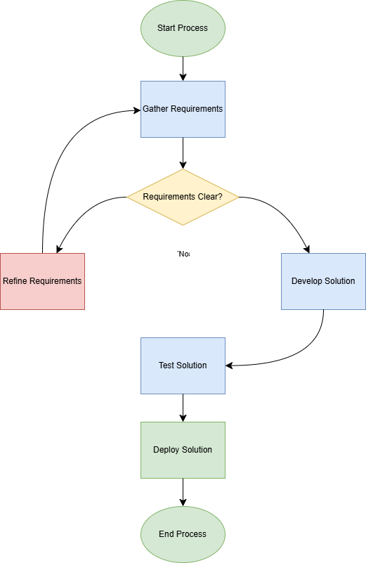

# SFMC Lifecycle Personalization Engine

## Overview
Enterprise-level simulation of Salesforce Marketing Cloud lifecycle architecture.

This demo simulates:
- Global suppression logic
- Journey exit conditions
- Loyalty-based discount segmentation
- Multi-language personalization
- Dynamic urgency logic
- Modular business logic functions

## Architecture Flow

Contact Data  
↓  
Suppression Check  
↓  
Journey Exit Check  
↓  
Discount Engine  
↓  
Personalization Renderer  

## Live Demo
(https://github.com/RuchikaSandolkar)

## Technical Stack
- HTML
- CSS
- Vanilla JavaScript

## Architecture Diagram

## Key Design Decisions

1. Suppression logic is evaluated before behavioral logic to ensure compliance priority.
2. Journey exit logic executes before incentive calculation to prevent redundant messaging.
3. Discount calculation is abstracted into a dedicated function for scalability.
4. Rendering logic is separated from business logic to mimic enterprise architecture layering.

## Mapping to Salesforce Marketing Cloud

Simulation Component → SFMC Equivalent

Contact Object → Contact Builder Attributes  
Suppression Flag → Global Suppression Data Extension  
Recent Purchase Flag → Journey Exit Decision Split  
Discount Engine → SQL Segmentation Logic  
Greeting Logic → Dynamic Content Rules  
renderEmail() → Journey Send Activity  

## Why This Matters

In enterprise Salesforce Marketing Cloud environments,
incorrect suppression logic or improper journey exit criteria
can lead to compliance violations, duplicate sends, and revenue loss.

This simulation demonstrates structured lifecycle decision flow:
1. Global suppression governance
2. Behavioral exit logic
3. Segmentation-based incentive calculation
4. Dynamic personalization rendering

